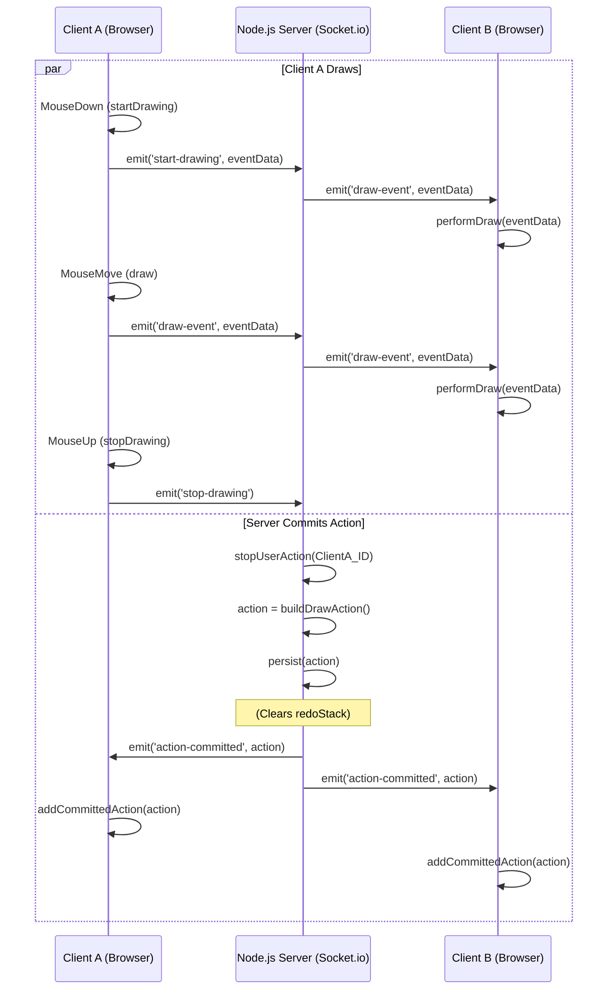

# Application Architecture

This document details the technical architecture of the Real-Time Collaborative Canvas, explaining data flow, state management, and key design decisions as required by the assignment.

## 1. Data Flow Diagram

The following diagram illustrates the flow of a single drawing event from one user (Client A) to another (Client B).

---

## Data Flow Explanation:

1. **Live Drawing (Event Streaming):**

- When **Client A** starts drawing (`mousedown`), it immediately calls `performDraw` locally for instant feedback. It also emits a `start-drawing` event to the server.

- The server receives `start-drawing` and broadcasts a `draw-event` to Client B. Client B receives this and calls `performDraw`.

- As Client A moves the mouse (`mousemove`), it calls `performDraw` locally and emits `draw-event` messages.

- The server receives these `draw-event` messages and simply broadcasts them to Client B, who draws them as they arrive. This achieves the "see as they draw" requirement.

2. **Action Committing (State Sync):**

- When **Client A** releases the mouse (`mouseup`), it emits `stop-drawing`.

- The server receives `stop-drawing` and finalizes the `DrawAction` (which is the complete stroke).

- The server saves this complete action to the room's permanent history in Vercel KV and clears the redo stack.

- The server then emits `action-committed` to all clients (including Client A).

- All clients receive this message and add the complete `DrawAction` to their local history, saving a snapshot of the canvas state to their client-side cache.

---

## 2. WebSocket Protocol (Socket.io)

The communication is action-based, using Socket.io to manage WebSocket messages.

### Client-to-Server (Emitters)

- `'join-room'` (Implicit on connection): The client sends its desired `roomName` in the initial socket query.

- `'start-drawing'` (data: DrawEventData): Sent on `mousedown` for a brush/eraser stroke.

- `'draw-event'` (data: DrawEventData): Sent on `mousemove` (while drawing).

- `'stop-drawing'` (): Sent on `mouseup` after a brush/eraser stroke.

- `'draw-shape'` (data: DrawEventData): Sent on `mouseup` when using the Rectangle tool. This is a single event that defines the whole shape.

- `'cursor-move'` (data: {x, y}): Sent on every `mousemove` (even when not drawing).

- `'undo'` (): Sent when the user clicks the Undo button.

- `'redo'` (): Sent when the user clicks the Redo button.

- `'clear-canvas'` (): Sent when the user clicks the Clear button.

### Server-to-Client (Listeners)

- `'welcome'` (data: {self, others}): Sent only to a new user, giving them their user object and a list of other users in the room.

- `'global-redraw'` (history: DrawAction[]): Sent only to a new user, providing the complete, ordered history of all committed actions for the room.

- `'new-user-connected'` (user: User) : Broadcast to all clients when a new user joins.

- `'user-disconnected'` (id: string): Broadcast to all clients when a user leaves.

- `'draw-event'` (data: DrawEventData): Broadcast to other clients during a live drawing stroke.

- `'cursor-move'` (data: {id, x, y}): Broadcast to other clients to update cursor positions.

- `'action-committed'` (action: DrawAction): Broadcast to all clients when a user finishes a stroke or shape. This is the signal to save the action to local history and the state cache.

- `'perform-undo'` (actionId: string) : Broadcast to all clients when an undo is triggered. Clients use this ID to find and remove the action locally.

- `'perform-redo'` (action: DrawAction) : Broadcast to all clients when a redo is triggered. Clients use this to re-add the action.

- `'perform-clear'` (): Broadcast to all clients to clear their local canvas and history.

---

## 3. Undo/Redo Strategy

The global undo/redo is the most complex state-synchronization problem. This architecture solves it by maintaining a single source of truth on the server.

### Server-Side State (The \"Truth\")

The server's `drawing-state.ts` maintains two key lists for each room, which are persisted in Vercel KV:

1. `actionHistory: DrawAction[]`

2. `redoStack: DrawAction[]`

A `DrawAction` is a complete user operation (e.g., a full brush stroke from `mousedown` to `mouseup`, or a single rectangle).

- On `undo`:

  1. A client emits `undo`.
  2. The server receives it.
  3. The server `pop()`s the last `DrawAction` from `actionHistory` and `push()`es it onto the `redoStack`.
  4. The server broadcasts `perform-undo` with the `actionId` of the popped action.
  5. All clients receive this, find that action in their `local history`, and remove it. They then restore the canvas state from the snapshot before that action (see Performance Decisions).

- On `redo`:

  1. A client emits `redo`.
  2. The server receives it.
  3. The server `pop()`s an action from `redoStack` and `push()`es it back onto `actionHistory`.
  4. The server broadcasts `perform-redo` with the full `DrawAction` object.
  5. All clients receive this, re-add the action to their local history, and re-draw it.

- On New Action: When any user commits a new action, the server adds it to `actionHistory` and clears the `redoStack`. This is critical and standard behavior for undo systems.

This strategy ensures that all clients are always synchronized with the server's single, authoritative history.

---

## 4. Performance Decisions

- **Client-Side Event Streaming:** For live drawing, events (`draw-event`) are streamed directly to other clients without waiting for database persistence. This provides the lowest possible latency for the \"live\" feel. The database is only updated when the action is committed (`stop-drawing`).

- **Client-Side State Caching:** The most significant performance optimization is the client-side `stateCache` in `main.ts`.

  - This is a `Map<string, ImageData>` that stores a snapshot of the entire canvas (`ctx.getImageData()`) after each `DrawAction` is committed.

  - Why? When an undo occurs, the client does not need to \"rebuild the canvas from scratch.\"

  - **Without Cache:** To undo, the client would have to clear the canvas and re-play all N-1 actions from history. This would be visually slow and computationally expensive.

  - **With Cache:** To undo, the client simply looks up the `ImageData` for the previous action (N-1) and \"blasts\" it onto the canvas using `ctx.putImageData()`. This is an instantaneous operation, regardless of how complex the history is. This solves the \"efficient redrawing strategy\" challenge.

- **Serverless Persistence (Vercel KV):** Using a serverless Redis database (Vercel KV) is a performance choice. It's extremely fast for reads/writes (ideal for state) and scales automatically. The server doesn't manage a heavy database connection pool. The state is loaded once when a room is first joined, and then only written on action commits.

- **Batched Actions:** A `DrawAction` is effectively a \"batch\" of all the small `DrawEventData` segments that make up one stroke. This keeps the permanent history clean and small, storing only 1 \"action\" per stroke instead of 100s of tiny segments.

---

## 5. Conflict Resolution

This architecture primarily **avoids** conflicts rather than resolving them.

- **Drawing Conflicts:** The assignment asks how to handle \"when multiple users draw in overlapping areas.\" In this model, this is not a conflict — it is simply a feature. Because all events are timestamped (implicitly by arrival at the server) and broadcast, the \"last event wins\" rule applies naturally. If User A and User B draw over the same pixel, the pixel will simply take the color of whichever user's `draw-event` message was processed last by the server. This is a simple, robust, and predictable model.

- **Undo Conflicts:** This is the more complex problem (e.g., \"User A undoes User B's action\"). The global-history model explicitly allows this.

  - The `actionHistory` is a single, shared stack.

  - If User A draws, then User B draws, the stack is `[ActionA, ActionB]`.

  - If User A then clicks Undo, the server pops `ActionB` (the last item) off the stack, even though User B created it.

  - This meets the \"works globally across all users\" requirement. The \"Undo\" button is not \"Undo my last action,\" it is \"Undo the last action.\" This is the simplest and most robust implementation of a global undo.
